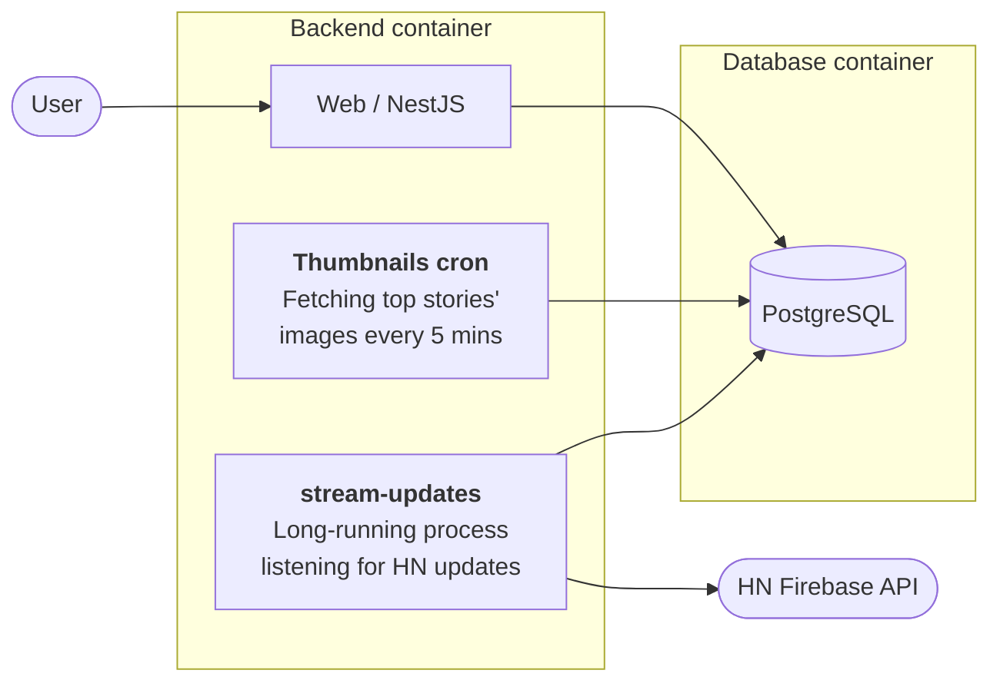

# Hacker News Aggregator

Daily rankings of the top Hacker News stories, organized by date, week or month. Built to make it easy to see what's currently and recently been trending. Intentionally kept simple and minimal. Live at [hnagg.com](https://hnagg.com).

## Architecture



- **Backend** -- NestJS application that serves HTML pages (Handlebars templates) and a REST API. Streams live updates from the HN Firebase API, stores stories and score/comment snapshots in PostgreSQL, serves paginated stories by day/week/month, and generates sitemaps.
- **Database** -- PostgreSQL 18.

## Prerequisites

- Docker and Docker Compose
- Copy `.env.example` to `.env` and fill in the values

## Running locally

```sh
docker compose up --build -d
```

| Service  | URL                          |
|----------|------------------------------|
| Backend  | http://localhost:50142       |
| Postgres | localhost:50143              |

## Deploying to production

```sh
git pull
docker compose build --no-cache
docker compose up -d --force-recreate backend
```

## CLI commands

Run inside the backend container:

```sh
docker compose exec backend npm run cli stream-updates                        # long-running: streams live HN updates
docker compose exec backend npm run cli fetch-og-metadata <itemId>            # fetch OG metadata for a single item
docker compose exec backend npm run cli fetch-og-metadata-for-date <date>     # fetch OG metadata for top 150 stories on a date (YYYY-MM-DD)
docker compose exec backend npm run cli fetch-og-metadata-for-date <date> --force  # refetch even if metadata already exists
docker compose exec backend npm run cli import-data                           # one-time bulk import
```

## License

MIT
